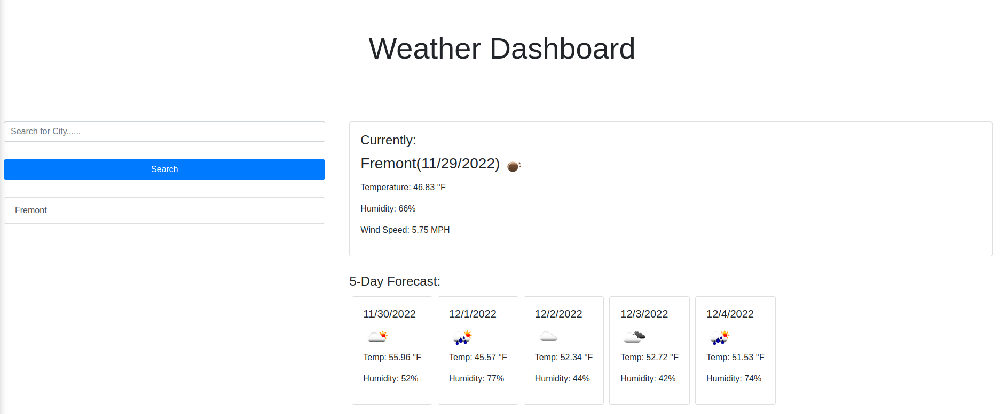
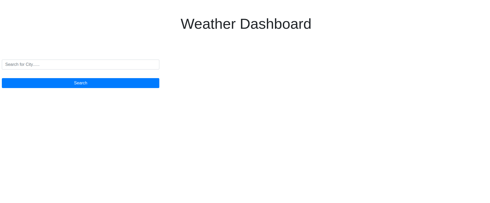

# weather-dashboard

page - https://cridder.github.io/weather-dashboard/

repo - https://github.com/cridder/weather-dashboard

https://courses.bootcampspot.com/courses/2756/assignments/42560?module_item_id=799420

## Weather Dashboard

Server-Side APIs Challenge: Weather Dashboard

Third-party APIs allow developers to access their data and functionality by making requests with specific parameters to a URL. Developers are often tasked with retrieving data from another application's API and using it in the context of their own. Your challenge is to build a weather dashboard that will run in the browser and feature dynamically updated HTML and CSS.

Use the 5 Day Weather Forecast https://openweathermap.org/forecast5 to an external site.to retrieve weather data for cities. The base URL should look like the following: https://api.openweathermap.org/data/2.5/forecast?lat={lat}&lon={lon}&appid={API key}. After registering for a new API key, you may need to wait up to 2 hours for that API key to activate.

## HINT

Using the 5 Day Weather Forecast API, you'll notice that you will need to pass in coordinates instead of just a city name. Using the OpenWeatherMap APIs, how could we retrieve geographical coordinates given a city name?

You will use localStorage to store any persistent data. For more information on how to work with the OpenWeather API, refer to the Full-Stack Blog on how to use API keys Links to an external site..

## User Story

- [x] AS A traveler
  - [x] I WANT to see the weather outlook for multiple cities
    - [x] SO THAT I can plan a trip accordingly

## Acceptance Criteria

- [x] GIVEN a weather dashboard with form inputs
- [x] WHEN I search for a city
  - [x] THEN I am presented with current and future conditions for that city and that city is added to the search history
- [x] WHEN I view current weather conditions for that city
  - [x] THEN I am presented with the city name, the date, an icon representation of weather conditions, the temperature, the humidity, and the the wind speed
- [x] WHEN I view future weather conditions for that city
  - [x] THEN I am presented with a 5-day forecast that displays the date, an icon representation of weather conditions, the temperature, the wind speed, and the humidity
- [x] WHEN I click on a city in the search history
  - [x] THEN I am again presented with current and future conditions for that city

